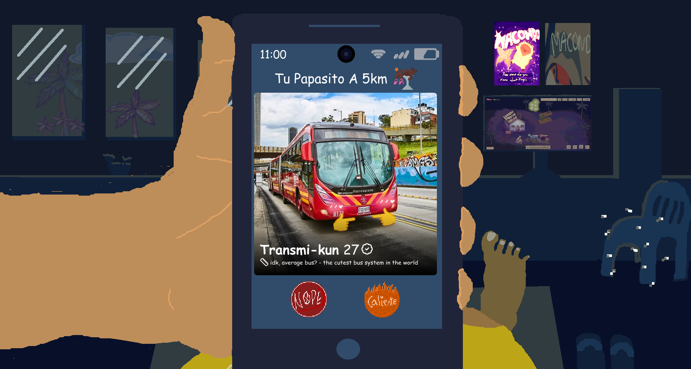
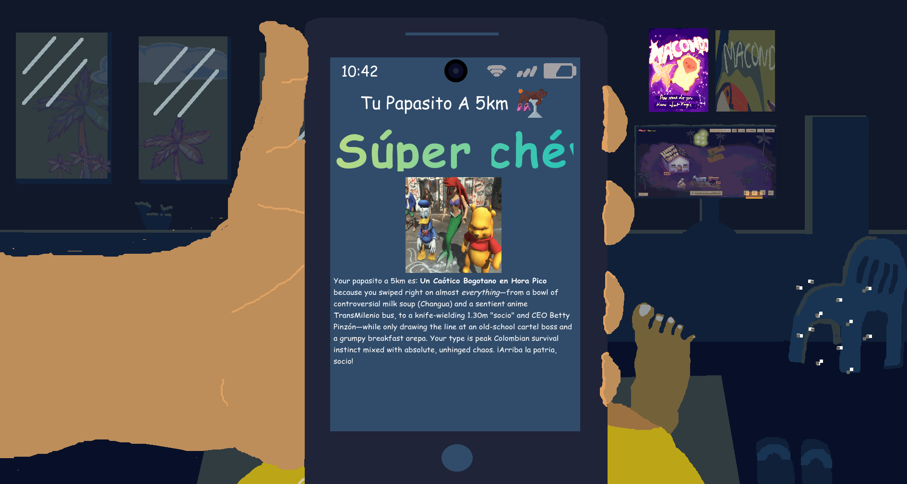

<h1 align="center">Tu papasito a 5km</h1>

Imagine a Tinder, but with the most random and ridiculous things possibly. Not only that, but you can know about what's your perfect type at the end!

## Stack

We used SvelteKit with Tailwind CSS, and SvelteKit's remote functions + [Hackclub AI](https://ai.hackclub.com/) for the AI implementation.

## Getting Started

```bash
git clone https://github.com/chardynamics/tu-papasito-a-5km.git
cd tu-papasito-a-5km
cp .env.template .env # configure environment variables
npm install

npm run build
node build
```

## Screenshot




